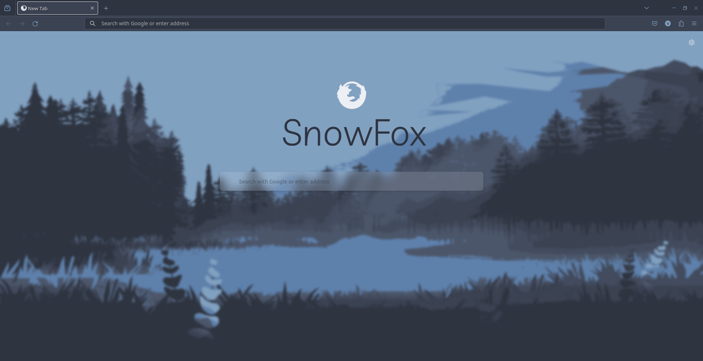

# snowFox
A nordic firefox reskin 

## Installation

#### Enable legacy user profile customization

1. Open your firefox browser
2. Go to about:config (type "about:config" in the address bar)
3. Set "toolkit.legacyUserProfileCustomization.stylesheets" to true

#### Copy the "chrome" folder to your firefox profile

1. Open your firefox browser
2. Go to about:support (type "about:support" in the address bar)
3. Look for the "Profile Directory" section and click on the "Open Directory" button
4. Copy the "chrome" folder from the repository to the profile directory
5. Restart your firefox browser

## Credits
Nord theme: [Nord](https://www.nordtheme.com/)  
Works best with [this](https://addons.mozilla.org/en-US/firefox/addon/nord-theme/) firefox theme (the one in the screenshot)
